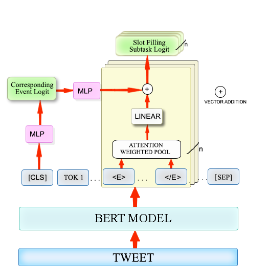
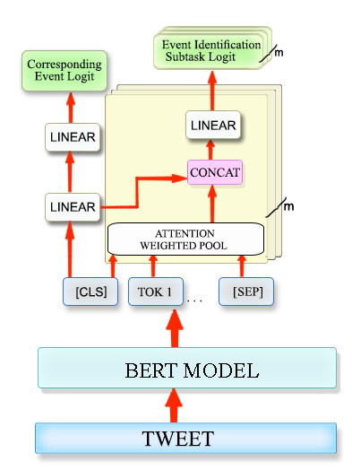

# Extract COVID Entities

Code for the system that bagged 1st position at EMNLP 2020 workshop WNUT Shared Task-3. 

Refer [shared task website](http://noisy-text.github.io/2020/extract_covid19_event-shared_task.html) for full details.

**Code Credits**: The starter code for slot-filling model was obtained from [viczong/extract_COVID19_events_from_Twitter](https://github.com/viczong/extract_COVID19_events_from_Twitter)

## Dependencies and set-up

- python 3.8
```conda create --name covid_entities python=3.8``` & ```conda activate covid_entities```
- PyTorch 1.5.0, cudatoolkit=10.1
```conda install pytorch==1.5.0 cudatoolkit=10.1 -c pytorch```
- Huggingface transformers - 2.9.0
```pip install transformers==2.9.0```
- scikit-learn 0.23.1
```pip install scikit-learn==0.23.1```
- scipy 1.5.0
```pip install scipy==1.5.0```
- ekphrasis 0.5.1
```pip install ekphrasis==0.5.1```
- wandb
```pip install wandb```

## Model Description

There are two models: one for slot-filling task and other for sentence classification. Both as built on 

### Slot-Filling



### Sentence Classification



## Instructions for training the models

0. Set up the codebase and requirements
   - `git clone https://github.com/Ayushk4/extract_covid_entity` & `cd extract_covid_entity`.
   - Follow the instructions from the `Dependencies and set-up` above to install the dependencies.
   - Set up your wandb, if you are interested in logging your runs. `wandb login`.
1. Set up the dataset: Follow instructions given in `data/README.md`
2. Recreating the experiments for our final submission:
   - For slot-filling use the multitask bert training command from [here](https://github.com/viczong/extract_COVID19_events_from_Twitter#models-training-and-results): Add `--sentence_level` and `--run=<YOUR_RUN_NAME>` flags to the command. If you want to train on COVID_Twitter BERT, include `--covid` flag. Add `--wandb` if you want to track your runs on wandb.
   - For sentence classification models use the following command, first pre_process using `python3 pre_process.py` and then `python3 sent_model.py --data <PREPROCESSED-FILE-LOCATION> --task " + <TASK-NAME>`
## Trained Models

We release the models weights for our final submission.

##### Slot-filling models

| Task | Link |
| ------ | ------ |
| Tested Positive | [positive.tar.gz](https://github.com/Ayushk4/extract_covid_entity/releases/download/v0.0.1/positive.tar.gz) |
| Tested Negative | [negative.tar.gz](https://github.com/Ayushk4/extract_covid_entity/releases/download/v0.0.1/negative.tar.gz) |
| Denied Testing | [can_not_test.tar.gz](https://github.com/Ayushk4/extract_covid_entity/releases/download/v0.0.1/can_not_test.tar.gz) |
| Death | [death.tar.gz](https://github.com/Ayushk4/extract_covid_entity/releases/download/v0.0.1/death.tar.gz) |
| Cure/Prevention | [cure.tar.gz](https://github.com/Ayushk4/extract_covid_entity/releases/download/v0.0.1/cure.tar.gz) |

##### Sentence classification models

| Task | Link |
| ------ | ------ |
| Tested Positive | [sent_positive.tar.gz](https://github.com/Ayushk4/extract_covid_entity/releases/download/v0.0.1/sent_positive.tar.gz) |
| Tested Negative | [sent_negative.tar.gz](https://github.com/Ayushk4/extract_covid_entity/releases/download/v0.0.1/sent_negative.tar.gz) |
| Denied Testing | [sent_can_not_test.tar.gz](https://github.com/Ayushk4/extract_covid_entity/releases/download/v0.0.1/sent_can_not_test.tar.gz) |
| Death | [sent_death.tar.gz](https://github.com/Ayushk4/extract_covid_entity/releases/download/v0.0.1/sent_death.tar.gz) |
| Cure/Prevention | [sent_cure.tar.gz](https://github.com/Ayushk4/extract_covid_entity/releases/download/v0.0.1/sent_cure.tar.gz) |

##### Model performances on test set.


| Task | Micro-F1 | Micro-Precision | Micro-Recall |
| ------ | ------ | ------ | ------ |
| Tested Positive | 0.676 | 0.802 | 0.584 |
| Tested Negative | 0.663 | 0.659 | 0.667 |
| Denied Testing | 0.652 | 0.666 | 0.640 |
| Death | 0.694 | 0.724 | 0.667 |
| Cure/Prevention | 0.621 | 0.745 | 0.532 |
| **Overall** | **0.660** | **0.727** | **0.604** |

## Coming Soon!

- Instructions for running our trained models on test set
- Details about our model architecture.
- Replicating our other experiments.

## License

MIT

